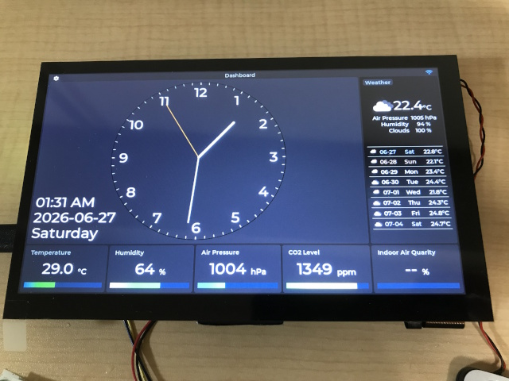
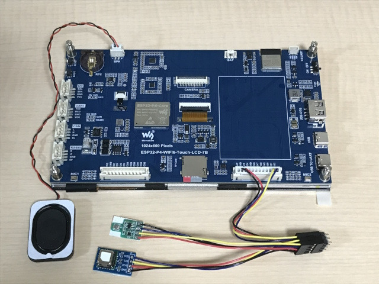

# SensorClock

🚧UNDER CONSTRUCTION🚧

 

> この家には壁掛け時計も置時計も無いな。一つ欲しいな。出来れば気温や湿度やCO2濃度なんかも見られたら良いな。

This is a documentation of my personal project to build a table clock with environmental sensors using a HMI display panel.

- It displays the current time and date, keeping the time synchronized using SNTP over Wi-Fi.
- It displays readings from environmental sensors, and optionally issues alerts when necessary.
- It displays a one-week weather forecast using [OpenWeather® One Call API 4.0](https://openweathermap.org/api/one-call-4). (API key required)
- It stores three months' worth of environmental data as a data logger and provides it in JSON format via an HTTP server.

**Table of Contents**

- [1. Hadrware](#1-hadrware)
	- [1.1. About Battery Operation](#11-about-battery-operation)
	- [1.2. 日本国内における技術基準適合証明](#12-日本国内における技術基準適合証明)
- [2. Tools Required for Development](#2-tools-required-for-development)
- [3. Firmware](#3-firmware)
	- [3.1. Introduction](#31-introduction)
	- [3.2. Configuration](#32-configuration)
	- [3.3. Preparing Fonts](#33-preparing-fonts)
	- [3.4. Options](#34-options)
		- [3.4.1. Choosing Screen Resolution](#341-choosing-screen-resolution)
		- [3.4.2. Enabling HTTPS Support for the HistoryServer](#342-enabling-https-support-for-the-historyserver)
	- [3.5. Security Consideration](#35-security-consideration)
	- [3.6. How The DataLogger and the HistoryServer Works](#36-how-the-datalogger-and-the-historyserver-works)
- [4. Developed by / License for the Created Data](#4-developed-by--license-for-the-created-data)
- [5. Acknowledgments](#5-acknowledgments)

## 1. Hadrware

- [WaveShare ESP32-P4-WIFI6-Touch-LCD-7B](https://docs.waveshare.com/ESP32-P4-WIFI6-Touch-LCD-7B) HMI display panel (7inch 1024 × 600)
- BME680 I2C temperature, humidity, barometric pressure, and gas sensor module
- SCD41 I2C CO2 sensor module

### 1.1. About Battery Operation

Since the steady-state current of the HMI panel is around 300 mA, battery power is not a practical option for a stationary device (IMO).

### 1.2. 日本国内における技術基準適合証明

この制作で使用したHMIディスプレイパネル製品は認証取得済みのモジュールを搭載しています。

- モジュール: ESP32-C6-MINI-1
- 認可番号: [007-AN0136](media/ESP32-C6-MINI-1%20TELEC%20Certification.pdf)

cf. [認証取得済みモジュールを内蔵する製品の場合](https://www.telec.or.jp/faq/#faq1_17)

---

## 2. Tools Required for Development

- [Visual Studio Code](https://code.visualstudio.com/)
- [ESP-IDF Extension for VS Code](https://marketplace.visualstudio.com/items?itemName=espressif.esp-idf-extension)
- [FontForge](https://fontforge.org/)
- [QCAD](https://www.qcad.org/)
- [OpenSCAD](https://openscad.org/)
- 3D printers
- solder and soldering irons
- wire strippers, wire cutters, pliers, files, screwdrivers, etc.

---

## 3. Firmware

### 3.1. Introduction

As I was getting started with firmware development, I learned that LVGL offers [a Win32 port](https://github.com/lvgl/lv_port_pc_visual_studio).  So, I decided to divide the application into modules, prototype most of the implementation to run on Windows, and replace only the platform-dependent modules with implementations using ESP-IDF/FreeRTOS functions.

### 3.2. Configuration

**Platform**: This application used ESP-IDF v5.5.4 as the base framework and LVGL v9.5 for the GUI, along with the WaveShare's board support package (BSP).

**I2C port**: I found the drivers for the SCD4x and the BME680 on the Espressif Component Registry. These drivers are implemented using the i2cdev library; however, since the BSP and the i2cdev conflict during I2C initialization, so I decided to assign these sensors to a port other than the one assigned to the BSP.

**Assets**: Since rendering the clock requires a font with a larger point size, a TTF file itself is embedded as a asset. Also, several images, sounds, and texts are embedded too. So, I choosed the FrogFS to allow load these assets as read-only files.

Taking these factors into account, the following `sdkconfig` options are required:

- CONFIG_I2CDEV_DEFAULT_SDA_PIN=52
- CONFIG_I2CDEV_DEFAULT_SCL_PIN=51
- CONFIG_LV_USE_LODEPNG=y
- CONFIG_LV_USE_TINY_TTF=y
- CONFIG_LV_TINY_TTF_FILE_SUPPORT=y
- CONFIG_LV_GRADIENT_MAX_STOPS=4
- CONFIG_LV_FONT_MONTSERRAT_14=y
- CONFIG_LV_FONT_MONTSERRAT_18=y
- CONFIG_LV_FONT_MONTSERRAT_36=y
- CONFIG_LV_USE_LOG=y
- CONFIG_LV_FS_DEFAULT_DRIVER_LETTER=88 # 'X' : not required but recommended
- CONFIG_LV_USE_FS_FROGFS=y
- CONFIG_LV_FS_FROGFS_LETTER=87 # 'W'
- CONFIG_LV_BUILD_DEMOS=n
- CONFIG_LV_BUILD_EXAMPLES=n
- CONFIG_LV_USE_SYSMON=n

If the chip revision is less than 3, the following options are also required:

- CONFIG_ESP32P4_SELECTS_REV_LESS_V3=y

The command `esptool chip_id` can be used to check the actual chip version.

When encountering the linker error “Linker error: --enable-non-contiguous-regions discards section...”, the following option may be required:

- CONFIG_COMPILER_OPTIMIZATION_SIZE=y

The following options are effective for utilizing PSRAM and preserving limited internal memory:

- CONFIG_SPIRAM_ALLOW_BSS_SEG_EXTERNAL_MEMORY=y
- CONFIG_SPIRAM_ALLOW_NOINIT_SEG_EXTERNAL_MEMORY=y
- CONFIG_SPIRAM_RODATA=y
- CONFIG_SPIRAM_TRY_ALLOCATE_WIFI_LWIP=y
- CONFIG_SPIRAM_XIP_FROM_PSRAM=y

The following options are required but should be set by default:

- CONFIG_BSP_I2C_NUM=1
- CONFIG_BSP_I2S_NUM=1
- CONFIG_ESP_HTTP_CLIENT_ENABLE_HTTPS=y
- CONFIG_MBEDTLS_CERTIFICATE_BUNDLE=y

The “factory” partition is likely to overflow with the default partition table, so a custom partition table is required. 

To complete the configuration of the ESP-IDF project, it is sufficient to follow the steps below within the IDE:

1. Select "ESP-IDF v5.5.4"
2. Select "esp32-p4" → "ESP32-P4 chip (via builtin USB-JTAG)"

### 3.3. Preparing Fonts

In addition to the standard LVGL fonts, I have provided versions of main fonts with character sets expanded to be equivalent to Latin-1. I have also provided semi-bold styles. To do this, I used the online font converter.

[LVGL Font Converter](https://lvgl.io/tools/fontconverter)

```
(Here, XX represents the font size)
Name: lv_font_montserrat_latin1x_XX
Size: XX
Bpp: 4bit-per-pixel
Fallback: none
Output format: C file

TTF/WOFF font: Montserrat-Medium.ttf
Range: 0x20-0xFF,0x2022

TTF/WOFF font: TTF/WOFF font: FontAwesome5-Solid+Brands+Regular.woff
Range: 61441,61448,61451,61452,61452,61453,61457,61459,61461,61465,61468,61473,61478,61479,61480,61502,61507,61512,61515,61516,61517,61521,61522,61523,61524,61543,61544,61550,61552,61553,61556,61559,61560,61561,61563,61587,61589,61636,61637,61639,61641,61664,61671,61674,61683,61724,61732,61787,61931,62016,62017,62018,62019,62020,62087,62099,62212,62189,62810,63426,63650
```

These conversion parameters basically follow the LVGL script. The script is located in the LVGL folder `managed_components/lvgl__lvgl/scripts/built_in_font`, which is fetched after the project is configured.

I have also added the `Monserrat-Medium.ttf` file itself to the assets so that the font can be displayed in a larger point size. To reduce the final image size, I cut down the character set of the font to the equivalent of Latin-1.

### 3.4. Options

While using `Kconfig.projbuild` makes it easy to switch between IDF configurations, it cannot be used for prototype code on Windows. Therefore, I used a more primitive manual method.

#### 3.4.1. Choosing Screen Resolution

If using a different HMI display panel, the screen resolution can be selected.

- Edit `main/gui/GuiConfig.h` to enable the correct preprocessor macro:
  - SCREENRES_1024x600
  - SCREENRES_800x600
- Edit `main/CMakeLists.txt` to ensure the appropriate fonts are compiled:
  - `lv_font_montserrat_latin1x_14.c` and `lv_font_montserrat_semibold_latin1x_14.c` for 1024x600
  - `lv_font_montserrat_latin1x_12.c` and `lv_font_montserrat_semibold_latin1x_12.c` for 800x480
- Open the IDF configration menu and ensure that the required fonts are checked:
  - CONFIG_LV_FONT_MONTSERRAT_XX, here XX={ 14, 18, 32 } for 1024x600
  - CONFIG_LV_FONT_MONTSERRAT_XX, here XX={ 12, 14, 28 } for 800x480

#### 3.4.2. Enabling HTTPS Support for the HistoryServer

Although it is not mandatory, enabling HTTPS is also an option. Thanks to the ESP-IDF, no additional implementation is required to add HTTPS support, but it's a little troublesome to obtain valid server certificates.

- Locate server certificates at `main/certs`:
  - `prvtkey.pem`
  - `servercert.pem`
- Edit `main/CMakeLists.txt` to enable the embedding line:
  - EMBED_TXTFILES "certs/servercert.pem" "certs/prvtkey.pem"
- Edit `main/modules/HttpServerCore.config.h` to enable the preprocessor macro:
  - HTTPSERVER_SUPPORT_HTTPS

### 3.5. Security Consideration

Since I intend to use this project only for personal use at home, I’m not too concerned about security; however, if it were to be released as a product, at least NVS encryption would be desirable. The Wi-Fi accespoint/passphrase and the API key are stored there.

### 3.6. How The DataLogger and the HistoryServer Works

The DataLogger collects a history of measurements from environmental sensors and weather data.

- It records the measurements from the sensors every 10 minutes, and the weather data is recorded every hour.
- It stores three months' worth of data in the internal volatile RAM.
- A micro SD card can be used for persistence (optional). The estimated amount of data written to the SD card is approximately 30MB/day, or 11GB/year. This amount of writing is excessive for the internal flash partition.
- All measured values are in metric units, i.e., °C, hPa, ppm, meters/second, etc.

The HistoryServer provides data collected by the DataLogger in JSON format via a web interface.

- Thanks to the mDNS server, it can be accessed by its server name.
- Allows clients to specify a time range for queries.

Example of request (HTTP/1.1 GET):
```
http://sensorclock.local/sensor?from=1777474800&to=1777561200
http://sensorclock.local/weather?from=1777474800&to=1777561200
```
- from: The UNIX timestamp at the start of the time range (optional)
- to: The UNIX timestamp at the end of the time range (optional)

Example of response:
```
{
	"status": "200 OK",
	"path": "/sensor",
	"from": "1777474800",
	"to": "1777561200",
	"length": "8",
	"data": [
		{
			"dt": "1777555800",
			"temp": "25.9",
			"humidity": "44",
			"pressure": "1013",
			"co2": "691",
			"iaq": "98"
		},
	...
	]
}
```
```
{
	"status": "200 OK",
	"path": "/weather",
	"from": "1777474800",
	"to": "1777561200",
	"length": "8",
	"data": [
		{
			"dt": "1777528800",
			"temp": "23.2",
			"pressure": "1006",
			"humidity": "36",
			"cloud": "69",
			"wind_speed": "0.45",
			"wind_deg": "329",
			"weather_id": "803",
			"weather_icon": "04n"
		},
	...
	]
}
```

---

## 4. Developed by / License for the Created Data

The CAD data for the enclosure and the source code for the firmware are developed by [yu2924](https://x.com/yu2924/) and released under CC0 1.0 Universal.

## 5. Acknowledgments

- [raspi-bme680-iaq by thstielow](https://github.com/thstielow/raspi-bme680-iaq)  Thanks for the great implementation.
- [svgSimpleImages by aikige](https://github.com/aikige/svgSimpleImages)  Thanks for the helpful images.
